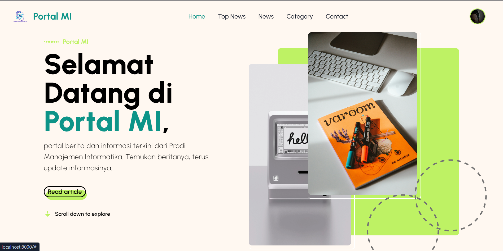

# Portal MI | `the news portal`

   

## 🌍 About

`Portal MI` is a news portal specifically created for Informatics Management study program students with various innovative and current news.

## 📸 Portal MI



## ✨ Pages & Menus

-   `Home Page` : Beranda, top news, etc.
-   `News` : all news
-   `category`
-   `Dashboard` : manage all resource Portal MI

## ✅ Run Locally

Clone the project into a local

```bash
  git clone https://github.com/MuhammadBobby/Portal-MI.git
```

Go to the project directory

```code
  cd Portal-MI
```

Open code in IDE like Visual Studio Code

```code
  code .
```

Open your terminal, install all necessary dependencies & run dependencies before starting :

```code
  npm install
  composer install
  npm run dev
```

next, run laravel

```code
  php artisan serve
```

#### Don't forget to activate your internet and run server🚀

## 💪 Resources

-   `PHP`
-   `Laravel`
-   `Google Developer / OAuth`
-   `Tailwind CSS`
-   `Flowbite`
-   `Google Fonts`
-   `Canva`
-   `MySQL`

## 🔗 Links

### Teams

**Muhammad Bobby**

[](https://muhammadbobby.github.io/portfolio-muhammad-bobby/)

[](https://www.linkedin.com/in/muhammad-bobby-oktaviano-1190482ba/)

[](https://www.instagram.com/code.lab_indonesia?igsh=cGs2aGxpYm9sZGw0)

**Auliya Ikhsana**

[](https://bit.ly/auliya_portofolio)

[](http://www.linkedin.com/in/auliyanasution)

[](https://www.instagram.com/aykhsn_?igsh=MW1na2lscGl5cDRoYw==)

## Author & Developer

-   [Muhammad Bobby](https://www.github.com/MuhammadBobby)
-   [Auliya Ikhsana Nasution](https://www.github.com/AuliyaIkhsanaNasution)
